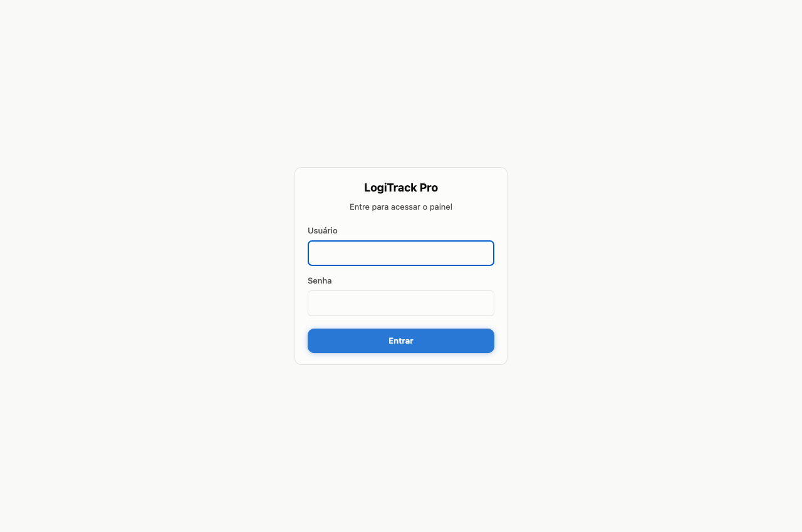
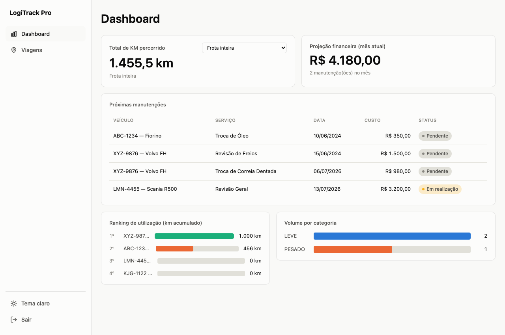
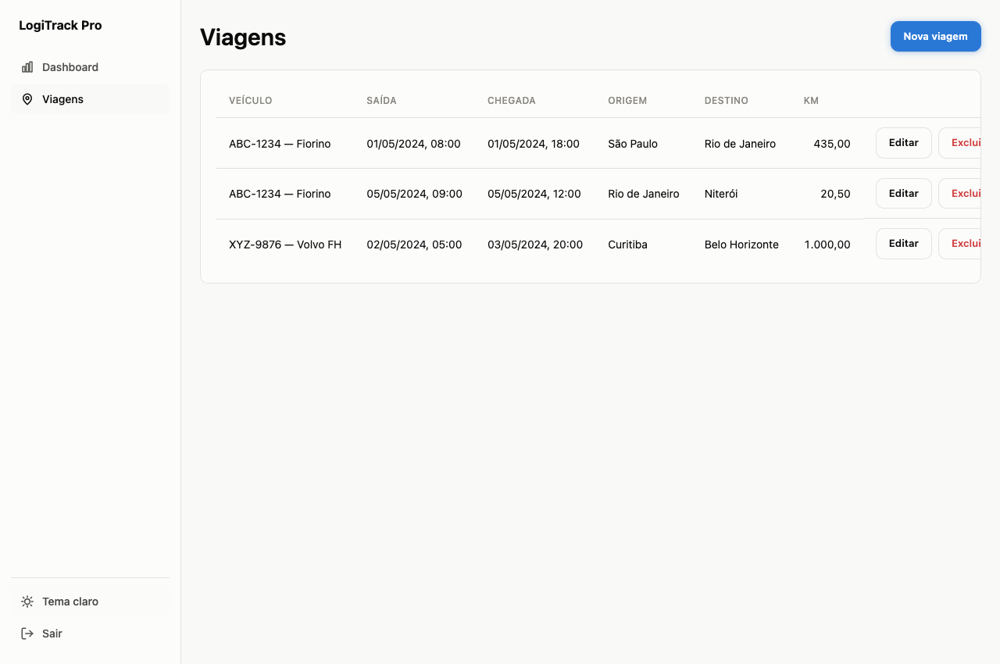
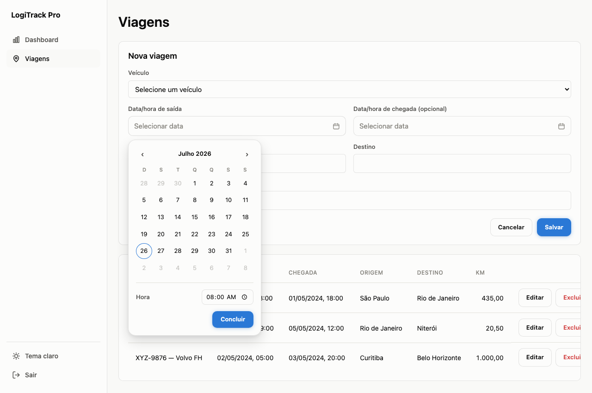
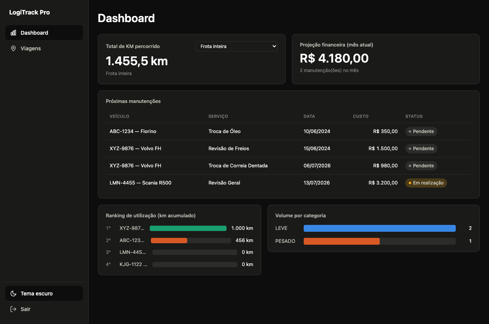

# LogiTrack Pro

MVP desenvolvido para o desafio técnico da **LogAp I.T. Solutions**: um sistema web para a LogiTrack (empresa fictícia de logística) centralizar o controle de sua frota, com um módulo de gestão de viagens e um dashboard de inteligência de dados.

## Demonstração

| Login | Dashboard |
|---|---|
|  |  |

| Viagens | Novo registro (calendário) |
|---|---|
|  |  |

<details>
<summary>Tema escuro</summary>


</details>

## Stack

- **Backend**: Java 21, Spring Boot 4.1 (Web, Data JPA, Validation, Security), Lombok, Maven
- **Banco de dados**: PostgreSQL 16
- **Autenticação**: Spring Security + JWT ([jjwt](https://github.com/jwtk/jjwt))
- **Frontend**: React 19 + TypeScript, Vite, React Router, Axios
- **Infra**: Docker + Docker Compose, Nginx (proxy reverso + servidor estático)

## Como rodar

### Opção 1 — Docker Compose (recomendado, um comando só)

Requisito: só o Docker instalado.

```bash
docker compose up --build
```

Acesse **http://localhost:8081**. O Postgres, o backend e o frontend sobem juntos, na ordem certa (o Compose espera cada serviço ficar saudável antes de subir o próximo).

Para derrubar tudo (e recomeçar o banco do zero):

```bash
docker compose down -v
```

### Opção 2 — Rodando local, sem Docker

Pré-requisitos: JDK 21+, Node 20+, e um Postgres rodando em algum lugar (pode ser via Docker, só pra esse banco).

**1. Banco de dados** (container avulso, isolado de qualquer Postgres que você já tenha instalado):

```bash
docker run -d --name logitrack-postgres-dev \
  -e POSTGRES_DB=logitrack_pro \
  -e POSTGRES_USER=logitrack \
  -e POSTGRES_PASSWORD=logitrack123 \
  -p 5433:5432 \
  postgres:16-alpine
```

**2. Backend** (sobe em `http://localhost:8080`; não precisa instalar Maven, o projeto usa o Maven Wrapper):

```bash
cd backend
./mvnw spring-boot:run
```

**3. Frontend** (sobe em `http://localhost:5173`):

```bash
cd frontend
npm install
npm run dev
```

### Credenciais de demonstração

```
usuário: admin
senha:   admin123
```

### Documentação da API

Com o backend no ar, a documentação interativa (Swagger UI) fica em `http://localhost:8080/swagger-ui.html`.

## Arquitetura

```
Navegador
   │
   ▼
[React + TS]  ──(dev: Vite :5173 → API :8080 direto)──────────────┐
   │                                                                │
   ▼ (Docker: Nginx :8081)                                          │
[Nginx] ──proxy /api/*──▶ [Spring Boot :8080] ──JDBC──▶ [PostgreSQL :5433/5432]
```

Backend em camadas convencionais:

```
controller/   → recebe HTTP, valida entrada (@Valid), nunca fala com o banco direto
service/      → regra de negócio (interface + Impl)
repository/   → Spring Data JPA; queries do dashboard em SQL nativo (@Query)
model/        → entidades JPA (espelham as tabelas)
dto/          → contrato da API (records), nunca expõe entidade JPA direto
mapper/       → converte Entity ↔ DTO
security/     → JWT (geração, validação, filtro, entry point)
exception/    → tratamento de erro centralizado (@RestControllerAdvice)
config/       → CORS, Security
```

## As 5 métricas do Dashboard

Todas calculadas via SQL nativo (`@Query(nativeQuery = true)`), não em memória no Java — a agregação (`SUM`, `COUNT`, `GROUP BY`) é feita pelo Postgres, que é o lugar certo pra isso:

| Métrica | Onde | Observação |
|---|---|---|
| Total de KM percorrido | `ViagemRepository.calcularTotalKm` | Frota inteira ou filtrado por veículo (`?veiculoId=`) |
| Volume por Categoria | `VeiculoRepository.volumePorCategoria` | `LEFT JOIN` a partir de `veiculos` — categoria aparece mesmo com 0 viagens |
| Cronograma de Manutenção | `ManutencaoRepository.proximasManutencoes` | 5 mais recentes, excluindo `CONCLUIDA` |
| Ranking de Utilização | `VeiculoRepository.rankingUtilizacao` | Top 5 por km acumulado |
| Projeção Financeira | `ManutencaoRepository.projecaoFinanceiraMesAtual` | Soma do custo de manutenções com `data_inicio` no mês atual, **independente do status** (ver decisão abaixo) |

## Decisões técnicas

**Módulo de CRUD escolhido: Viagens** (não Manutenção). As tabelas/queries de manutenção continuam existindo e alimentando o dashboard, só não têm tela de CRUD própria (pois o enunciado frisava apenas um dos módulos, senão teria implementado os dois).

**`schema.sql` + `data.sql` em vez de Flyway ou `ddl-auto=update`.** Reaproveita quase literalmente o script fornecido pela empresa, sem introduzir uma ferramenta de migração para um MVP. `ddl-auto=update` foi descartado por ser antipadrão fora de prototipagem (não reproduz `CHECK` constraints e não é rastreável). O banco é **recriado do zero a cada subida do backend** — decisão consciente para garantir um dataset sempre consistente durante a avaliação; dados criados via CRUD não persistem entre reinícios.

**`BIGSERIAL`/`BIGINT` em vez de `SERIAL`/`INTEGER` nos IDs.** `Long` é o tipo idiomático para chaves primárias em Java/JPA, e o Hibernate valida o schema no boot — com `SERIAL` (32 bits) ele rejeita a inicialização por incompatibilidade com campos `Long` (64 bits). PK e FKs foram ajustadas de forma consistente.

**Índices adicionados em `viagens.veiculo_id`, `manutencoes.veiculo_id`, `manutencoes.data_inicio` e `manutencoes.status`.** Postgres não cria índice automático em coluna de foreign key (só na PK referenciada), e são exatamente essas colunas que o dashboard agrega e filtra.

**`NOT NULL` em `veiculo_id`** (viagens e manutenções) e **`CHECK` em `manutencoes.status`** — reforça no banco regras que o CRUD já exige, e replica o padrão de `CHECK` que o próprio script original já usa em `veiculos.tipo`.

**Duas manutenções extras no seed, com `data_inicio` calculada em cima de `CURRENT_DATE`.** O seed original é de 2024; sem isso, a métrica de Projeção Financeira ("mês atual") sempre mostraria R$ 0,00, não importa quando o projeto for avaliado.

**Projeção Financeira soma manutenções de qualquer status no mês atual** (não só `PENDENTE`). Interpretação adotada: é uma projeção do que está programado gastar no mês, então uma manutenção já `CONCLUIDA` dentro do mês ainda representa um gasto real daquele mês.

**Records (Java 17+) para DTOs**, entidades JPA com Lombok (`@Getter/@Setter`, nunca `@Data` — evita `equals`/`hashCode`/`toString` percorrendo relacionamentos e caindo em `LazyInitializationException`).

**Autenticação com usuário único via seed** (não há tela de cadastro) — suficiente para demonstrar o diferencial de segurança sem expandir o escopo do desafio. Token JWT stateless guardado no `localStorage` do navegador; alternativa de cookie `httpOnly` foi considerada, mas descartada por exigir CSRF token e configuração extra de `SameSite` sem ganho de segurança proporcional ao escopo deste projeto.

**Nginx como proxy reverso** (`/api/*` → backend) no ambiente Docker: resolve CORS de vez (o navegador só fala com uma origem) e evita ter que embutir a URL da API no bundle JS de produção.

**Porta `5433`** para o Postgres do projeto (tanto no `docker-compose.yml` quanto no container avulso de desenvolvimento) — evita conflito com qualquer instalação local de Postgres na porta padrão `5432`.

**`react-router-dom` fixado na major 6** — a v7 carrega uma lista extensa de CVEs concentradas em recursos de SSR/React Server Components/server actions (modo "framework") que esta aplicação não usa (SPA 100% client-side); a v6 não tem essa superfície de ataque.

## Alterações no script SQL fornecido

O script original (`Desafio LogAp TRE - Carga Inicial.sql`) foi mantido quase integralmente — as mudanças são listadas na seção de decisões acima. O script final em uso é [`backend/src/main/resources/schema.sql`](backend/src/main/resources/schema.sql) (schema) + [`backend/src/main/resources/data.sql`](backend/src/main/resources/data.sql) (seed), reproduzido aqui:

```sql
-- schema.sql
DROP TABLE IF EXISTS viagens, manutencoes, veiculos, usuarios CASCADE;

CREATE TABLE usuarios (
    id BIGSERIAL PRIMARY KEY,
    username VARCHAR(50) UNIQUE NOT NULL,
    senha VARCHAR(100) NOT NULL,
    nome VARCHAR(100)
);

CREATE TABLE veiculos (
    id BIGSERIAL PRIMARY KEY,
    placa VARCHAR(10) UNIQUE NOT NULL,
    modelo VARCHAR(50) NOT NULL,
    tipo VARCHAR(20) CHECK (tipo IN ('LEVE', 'PESADO')),
    ano INTEGER
);

CREATE TABLE viagens (
    id BIGSERIAL PRIMARY KEY,
    veiculo_id BIGINT NOT NULL REFERENCES veiculos(id) ON DELETE CASCADE,
    data_saida TIMESTAMP NOT NULL,
    data_chegada TIMESTAMP,
    origem VARCHAR(100),
    destino VARCHAR(100),
    km_percorrida DECIMAL(10,2)
);

CREATE TABLE manutencoes (
    id BIGSERIAL PRIMARY KEY,
    veiculo_id BIGINT NOT NULL REFERENCES veiculos(id) ON DELETE CASCADE,
    data_inicio DATE NOT NULL,
    data_finalizacao DATE,
    tipo_servico VARCHAR(100),
    custo_estimado DECIMAL(10,2),
    status VARCHAR(20) DEFAULT 'PENDENTE' CHECK (status IN ('PENDENTE', 'EM_REALIZACAO', 'CONCLUIDA'))
);

CREATE INDEX idx_viagens_veiculo_id ON viagens(veiculo_id);
CREATE INDEX idx_manutencoes_veiculo_id ON manutencoes(veiculo_id);
CREATE INDEX idx_manutencoes_data_inicio ON manutencoes(data_inicio);
CREATE INDEX idx_manutencoes_status ON manutencoes(status);
```

## Endpoints da API

| Método | Rota | Autenticação | Descrição |
|---|---|---|---|
| POST | `/api/auth/login` | Não | Login, retorna o JWT |
| GET | `/api/veiculos` | Sim | Lista veículos (popula os selects) |
| GET | `/api/viagens` | Sim | Lista viagens |
| GET | `/api/viagens/{id}` | Sim | Busca uma viagem |
| POST | `/api/viagens` | Sim | Cria viagem |
| PUT | `/api/viagens/{id}` | Sim | Atualiza viagem |
| DELETE | `/api/viagens/{id}` | Sim | Exclui viagem |
| GET | `/api/dashboard?veiculoId=` | Sim | As 5 métricas do dashboard |
| GET | `/actuator/health` | Não | Healthcheck (usado pelo Docker Compose) |

Detalhes de request/response de cada rota estão no Swagger UI (seção "Como rodar" acima).

## Diferenciais implementados

- ✅ **Frontend moderno**: React + TypeScript
- ✅ **Segurança**: tela de login com autenticação JWT, rotas protegidas
- ✅ **DevOps**: ambiente completo via Docker Compose (um comando sobe banco + backend + frontend)
- ✅ Tema claro/escuro
- ✅ Layout responsivo (sidebar no desktop, navegação inferior fixa no mobile)
